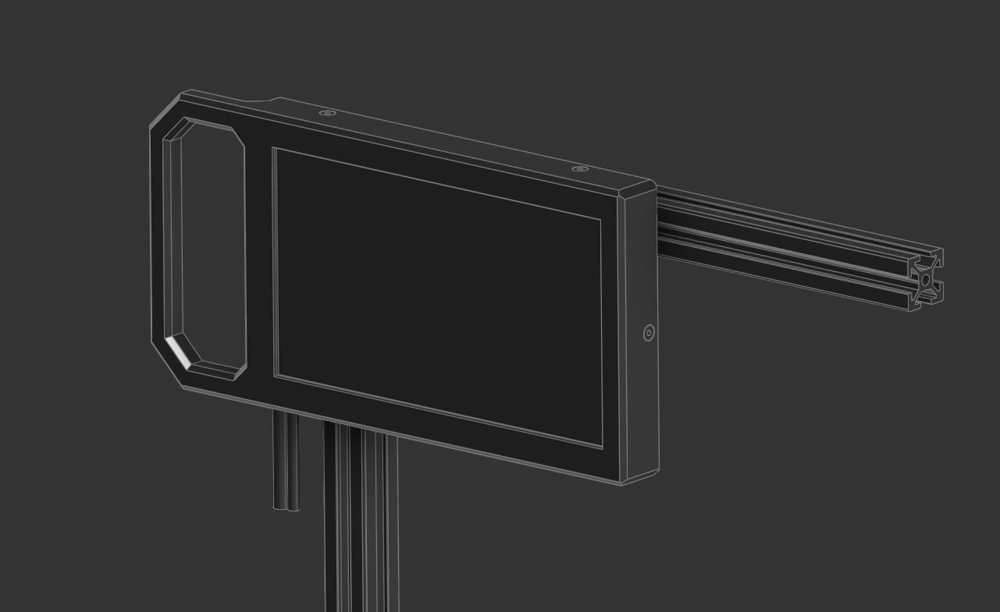
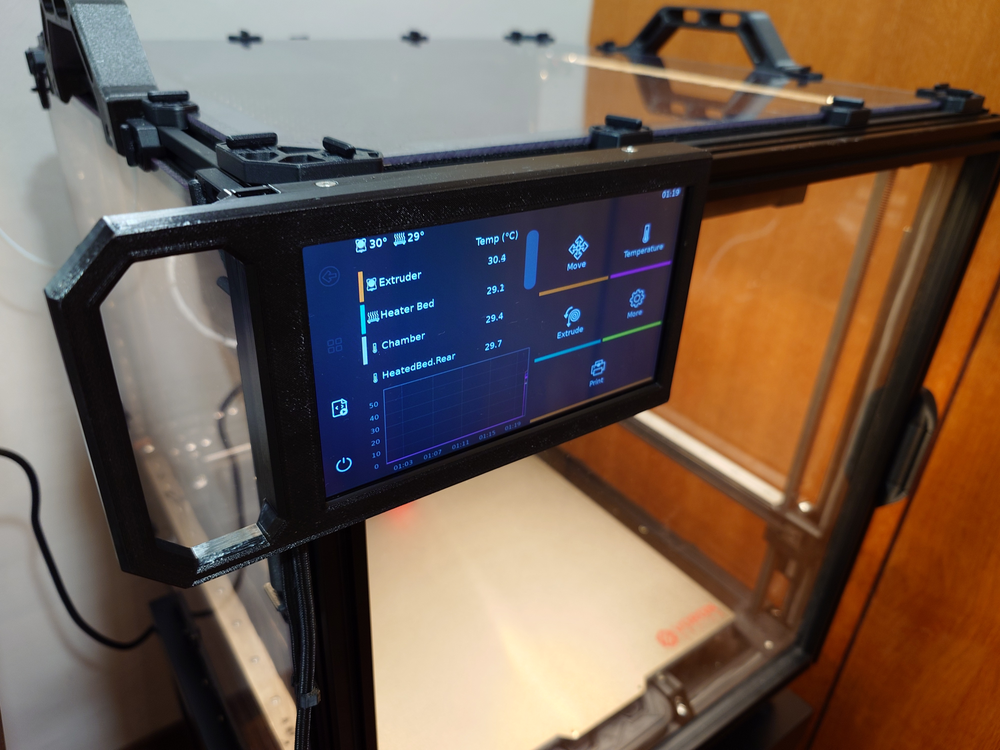
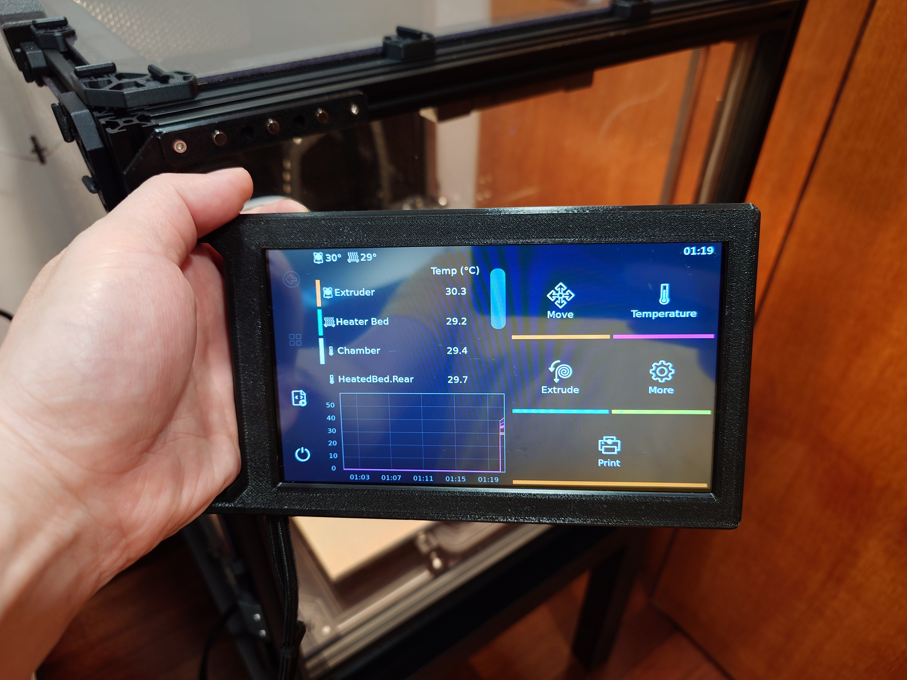

# BTT HDMI 7 v1.2 Screen Holder
A holder for the BigTreeTech HDMI 7 v1.2 screen that is not fixed to the bottom front of the printer that is commonly seen. This allows for the screen to be taken off the printer like a tablet to be manipulated at a more comfortable setting.

## Introduction

I like big screen, but what I did not like with many of the existing screen holders/designs was that they were all stationary. As I was set on getting the 7" screens, I designed a casing which effectively allowed you to use (in this case) the BTT HDMI 7 screen like a tablet (cables running from the printer aside).This requires some sort of a door mod that exposes 2020 aluminium extrusions to allow for the mounting system. I currently have mine installed on my Voron 2.4 with the [Clicky-Clacky Door Mod](https://github.com/tanaes/whopping_Voron_mods/tree/main/clickyclacky_door) installed.
Additionally this will only work with v1.2 of the BigTreeTech HDMI 7 screens. Unfortunately v1.1 had the HDMI and USB ports right at the side of the screen with causes the cable to be jutting out the side. 

## BOM

- 7x M3x8mm FHCB
- 3x M3x25mm SHCB 
- 6x M3x5x4mm “standard” Voron heatsets" 
- 3x M3 T-nuts
- 4x to 10x 6x3mm (diameter x thickness) neodymium magnets (At least 6x N54 rated magnets recommended)

Consumables 

- Superglue for magnet installation